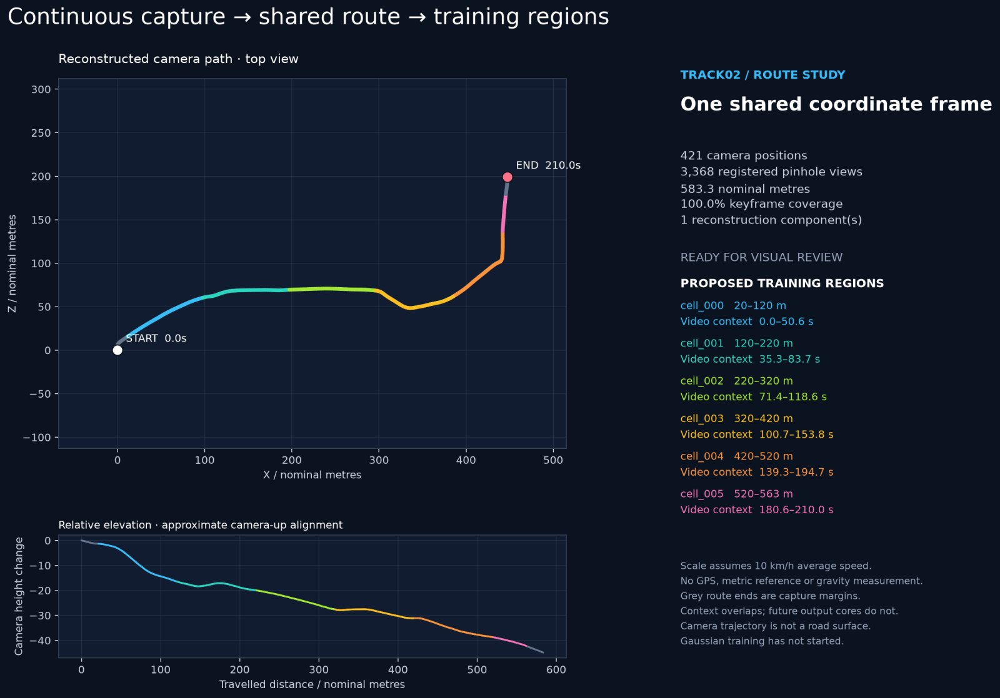
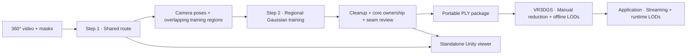
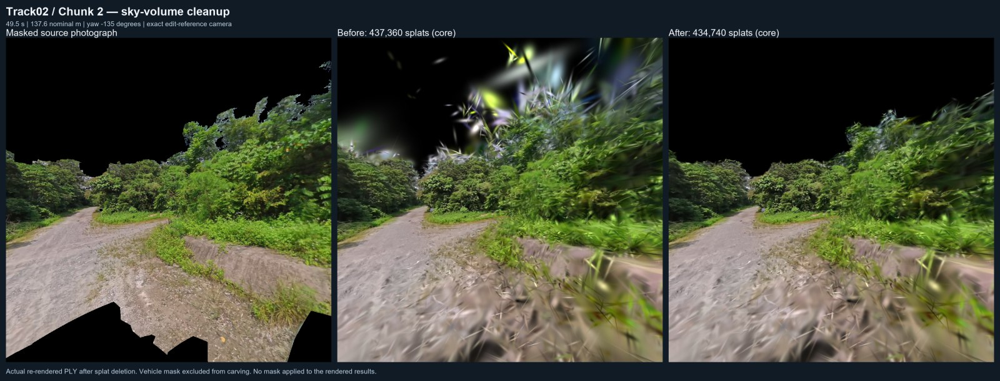

# Track3DGS

**Turn a continuous 360° video into aligned, inspectable 3D Gaussian track models.**

Track3DGS reconstructs one shared camera route, trains overlapping regions in that
coordinate frame, removes artifacts, and trims the results into route-owned cores.
It includes Python processing tools and a standalone Unity viewer for comparing
models and inspecting joins. **QuestSBTC is not required.**

[Get started](docs/setup.md) · [Step 1: route](docs/route-step1.md) · [Step 2: models](docs/route-step2.md) · [Sky cleanup](docs/sky-cleanup.md) · [Unity viewer](docs/unity-viewer.md) · [Output contract](docs/contracts/asset-package-v1.md)



*Track02: 421 registered panorama positions from a 3 minute 30 second capture.
The displayed 583.3 m length uses an assumed speed; it is not a surveyed distance.*

## Two steps, one coordinate frame



| Step | What it does | Main outputs |
|---|---|---|
| **1 — Reconstruct the route** | Select sharp frames, mask the vehicle/sky, project eight pinhole views, solve a calibrated panorama rig with COLMAP, establish shared coordinates, propose core/context intervals | `route.json`, `cameras.jsonl`, `regions.json`, visual reports and Unity camera markers |
| **2 — Train and assemble** | Train each region sequentially with Splatfacto, preserve the shared frame and SH3, clean artifacts, assign route ownership, review photographs/seams, export a draft package | Original/clean/core PLYs, source-row provenance, QC reports and Unity comparison caches |

Training contexts overlap to improve region ends. Exported core domains use
half-open route intervals to assign ownership. Gaussian footprints are not
geometrically clipped, so clean ownership alone does not guarantee a seamless join.

## Quick start

The supported processing setup is Windows, Python 3.11+, FFmpeg, COLMAP 4.1.1,
and an NVIDIA CUDA GPU. Training uses Python 3.11, PyTorch 2.7.1/cu128,
Nerfstudio 1.1.5 and gsplat 1.4.0. The optional viewer uses Unity 6000.3.19f1 / URP.
Follow [installation](docs/setup.md) to create the utility and GPU environments.

1. Put your video, vehicle keep mask and sky prior under `data/raw/`.
2. Copy `pipeline/configs/route.example.json`; set the inputs, approximate scale,
   output revision and tool paths. Paths are relative to the configuration file.
3. From `pipeline`, generate and inspect the route:

   ```powershell
   ..\.venv\Scripts\python.exe -m track3dgs.route --config configs/my-route.json --dry-run
   ..\.venv\Scripts\python.exe -u -m track3dgs.route --config configs/my-route.json
   ```

   Open the generated `reports/index.html`. For a Unity view, open the included
   `unity/Track3DGSViewer` project and follow the [route-marker instructions](docs/unity-viewer.md#step-1-route-markers).

4. Record your route review, then train a pilot region using the
   [Step 2 instructions](docs/route-step2.md#run-sequentially). Continue region by
   region after checking the pilot. Unity publication is optional; the Python
   pipeline can run by itself.
5. Inspect core joins and optionally run [view-guided sky cleanup](docs/sky-cleanup.md).
   Export and validate the [portable handoff](docs/route-step2.md#portable-draft-handoff).

**Bring your own data.** Videos, masks, learned models, checkpoints and generated
Unity caches are excluded from Git. A tiny synthetic viewer fixture is included
for testing the integration without a capture.

## Automatic sky cleanup

The optional cleanup uses actual camera poses and **sky-only masks** to remove
residual curtains and spikes. It combines centre projection with native-renderer
alpha contributions, repeats after newly hidden layers become visible, and offers
multi-position consensus to limit foreground damage. Retained rows keep their
original attributes and provenance.



*Model 2: 437,360 → 434,740 core splats. This is the camera used to guide the edit,
not an independent validation view. The renders show actual modified PLYs.*

The [cleanup guide](docs/sky-cleanup.md) includes configurable commands, the exact
Model 1 and Model 2 recipes, independent-view handling, counts and limitations.
The extracted algorithms reproduce both reviewed results byte-for-byte.

## Inspect in Unity

The [standalone viewer](unity/Track3DGSViewer) includes the pinned MIT-licensed
`wu.yize.gsplat` renderer and the editor/global-sort fixes used during development.
It provides:

- Camera-route markers, direction arrows and training boundaries.
- Raw, cleaned, trimmed-core and experimental sky-cleaned representations.
- At most **two visible models**, with explicit unloading between replacements.
- Before/after buttons that retain the camera pose and FOV in Edit mode.
- Recorded review viewpoints, route-station navigation and Scene-to-Game camera placement.
- Spark compression by default; a single-model uncompressed reference.

The viewer is a diagnostic tool. Runtime streaming, multiplayer, periscopes and
standalone Quest performance testing belong to the consuming application.

## Current evidence and limits

The [Track02 first pass](docs/track02-t001-results.md) trained six regions:

| Representation | Splats across all six regions |
|---|---:|
| Original training outputs | 3,921,244 |
| Initial cleanup, context retained | 3,830,327 |
| Trimmed route cores | 2,470,813 |

Most of the raw-to-core reduction comes from removing training context, not LOD
simplification. Additional sky cleanup removes 4,876 rows from Model 1's core
and 2,620 from Model 2's core. Some canopy thinning and reconstruction artifacts
remain. The 420 m join needs ground-coverage review; this is a **draft assembly**,
not a gap-free or production-quality acceptance result. Video-only scale and
absolute grade are approximate. Standalone Quest performance is not yet established.

CPU regression tests cover route identities, grouped holdouts, ownership,
provenance, coordinates and cleanup decisions. GPU reproductions and the
independent Unity renderer checks are recorded in the
[standalone verification notes](docs/validation/standalone-release.md).

## Repository map

```text
pipeline/track3dgs/          Route, training, cleanup, QC and package commands
pipeline/configs/           Portable route example and reproduction profiles
pipeline/tests/             CPU regressions and synthetic Unity fixture
unity/Track3DGSViewer/       Independent Unity editor project + pinned renderer
docs/                       Setup, workflows, architecture, contracts and evidence
data/                       Your local inputs/results (Git-ignored)
```

[VR3DGS](https://github.com/blacktheon/VR3DGS) handles the subsequent general-purpose
manual reduction and offline LOD authoring. The game consumes those outputs and
implements runtime selection/streaming. See the [cooperation design](docs/architecture/pipeline-integration.md)
for the boundary between projects.

The earlier independently processed section workflow and experiments remain
available in the code and [historical workflow guide](docs/legacy-section-workflow.md).
Their fixed 10 m runtime tiles and older Unity renderer instructions are not the
current route workflow. Third-party renderer licenses and patch provenance are
preserved [with the embedded package](unity/Track3DGSViewer/Packages/wu.yize.gsplat/STAGE1_PATCHES.md).
