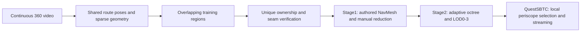

# Continuous route reconstruction, manual reduction, and periscope LOD

Date: 2026-09-29

Status: Proposed architecture for review. This document does not record implemented features or successful device measurements. It supplements the older Track3DGS design and the VR3DGS Stage2 plan; their conflicting assumptions about fixed 10 m tiles, automatic driving, and all-camera rendering do not apply to this proposal.

Update: the requested split into two reusable authoring projects and one game consumer is specified in the newer [system integration design](../../architecture/pipeline-integration.md), [asset package v1](../../contracts/asset-package-v1.md), and [Track3DGS implementation plan](../plans/2026-09-29-route-reconstruction-and-regions.md). Those documents govern repository ownership and exact interchange fields; this proposal remains the route-quality rationale.

## 1. Agreed purpose and constraints

- QuestSBTC remains the multiplayer Unity application running on standalone Quest 3. Track3DGS supplies reconstructed assets; VR3DGS supplies offline Stage1/Stage2 processing and review.
- Driver, commander, and gunner are separate players. Each player sees outside through their own periscope view or views. Periscopes rotate but do not zoom.
- The driver moves freely within the allowed track area. Vehicle heading is not prescribed by the capture path. The recovered camera trajectory is evidence for reconstruction and coverage, not an autopilot route.
- The user authors a NavMesh for possible positions, reviews Stage1 retention percentages in VR, and accepts the quality/count tradeoff manually.
- Input is continuous 360 video. No GPS, IMU, or measured scale reference is available for the first test. Metric scale and absolute level are approximate.
- Existing edited models in `data/Export/Edited` remain preserved. The roughly 100,000-splat target per current section is an experiment, not a fixed budget for every future region.
- Headset movement recording and screenshot capture remain deferred. Authored and generated offline cameras provide development and held-out verification views.

Success means a continuous, inspectable route with explicit coordinate provenance, validated region joins, reversible manual reduction, useful spatial LODs, and measured standalone performance in the actual simulator.

## 2. Recommended approach and alternatives

Recommended: reconstruct one connected route coordinate system, train bounded regions using shared poses and overlapping observations, assemble a route with unique region ownership, then apply Stage1 and adaptive spatial Stage2 LOD.

Alternative: register the existing edited models into a newly reconstructed route. This may preserve substantial manual work, but cuts and local reconstruction distortions may require local retraining. It is a migration option, not the main guarantee of continuity.

Alternative: train the entire kilometre as one dense model and split afterward. This is not required for LOD and gives the current GPU a much larger training job. Keep partitioned training as the default.

## 3. Route coordinates before Gaussian training

Extract frames with stable identities tied to the source-video hash and original timestamps. Derived pinhole crops retain their parent frame identity and calibrated crop orientation. Do not restart frame identity in every temporary video cut.

Use the existing masks, perspective-view extraction, and COLMAP work as a starting point. Solve one connected reconstruction across the continuous recording. Use temporal matches plus additional spatial/revisit matches where useful. Preserve the known relationships between crops from the same panorama; verify which rig constraints the installed COLMAP mapper actually supports before depending on them.

For larger recordings, SfM may itself run in overlapping windows, provided they share image identities, are registered into one frame, and undergo joint alignment/refinement. Multiple independently normalized trajectories are not an acceptable substitute for a connected route. Disconnected sections or an interval with failed tracking must be reported, not silently bridged with a straight line.

Export timestamped camera/rig poses, sparse landmarks, accumulated route distance, reconstruction confidence, and one transform into Unity coordinates. Apply any global scale/orientation adjustment once to all related geometry and cameras. Preserve bends, height changes, pitch, and roll supported by reconstruction. Do not reset the origin and forward direction independently for each region, and do not flatten the trajectory to a plane.

Video-only reconstruction does not establish true metres or reliable absolute gravity. Use a provisional global scale/orientation with `scale_status: approximate` and record its basis. The existing nominal-speed estimate may be a starting estimate only; it is not a speed measurement or a constraint that the tank drove uniformly. Provide one route-wide Unity scale/level adjustment before accepting the NavMesh and camera offsets. A later calibration changes the route version and invalidates dependent view/rank/layout metadata as necessary.

Keep route distance separate from video duration. A 150-second input is not automatically one kilometre. All proposed metre values below are nominal until calibrated.

The camera mount transform is distinct from the vehicle reference transform and periscope offsets. A recorded camera path above the road must not be used directly as the vehicle ground-contact path. Do not claim survey accuracy for video-only elevation or a long, open route with accumulated drift.

## 4. Training regions: owned core plus observation overlap

Use approximately 100 m owned cores as an initial proposal, with roughly 20 m of training context on either side. Adapt these values to image coverage, turns, scene complexity, available memory, and seam results. Ten cells per kilometre is a planning example, not a mandatory count.

Example internal regions:

| Region | Cameras/context initially selected from | Owned route interval |
|---|---|---|
| A | 80-220 m | 100-200 m |
| B | 180-320 m | 200-300 m |

Select additional cameras that genuinely observe the owned volume where useful; route interval alone is not a complete visibility test. Shared boundaries should have observations on both sides. Choose or move boundaries away from weak reconstruction where possible. A training job that exceeds memory can split its core while preserving the same global coordinate contract.

Train using shared global camera poses and sparse geometry. Disable independent centering, scaling, and orientation normalization. Begin with fixed accepted poses; any later camera refinement must preserve consistency with adjacent regions. Apply a consistent exposure/color policy across cells. Process every planned cell, with resumable outputs; the current runner's fixed `--cell 0` is not sufficient.

The actual recording start and end have no observations beyond them. Capture extra footage before and after the desired playable area when possible. Otherwise, designate the poorly supported ends as nonplayable margins after inspection. Padding cannot invent missing observations.

## 5. Assembly, overlap ownership, and seam repair

Training overlap is intentional. Export ownership is separate. Build a deterministic map from world-space ownership volumes to source regions and export the selected content once. Use route-aware volumes for ordinary stretches; use explicit spatial ownership where the route doubles back, intersects, or passes close to itself. A nearest-trajectory-point rule alone must not allocate the same tree to different passes through a hairpin.

Retain immutable full training outputs. Export filtering is reversible and produces an ownership/removal report. Give retained splats stable IDs scoped by their source region and model version. Refinement-created splats receive new identities with parent-region provenance.

Do not interpret ownership as geometrically clipping Gaussian ellipsoids. A splat is owned by one region/chunk while its full footprint may extend across the boundary. Use conservative extent bounds for visibility and loading. Normal Gaussian overlap remains necessary for rendering; the goal is to avoid duplicating independently reconstructed region content.

Unique IDs and disjoint ownership do not prove that independent reconstructions match visually. Nearby Gaussians are also not automatically redundant: they may represent leaves, transparency, or different surfaces. Do not perform blanket radius-based deletion of overlap candidates.

For every boundary, compare assembled renders from both travel directions, relevant vehicle headings, all periscope roles, and views that look across the boundary. Before the user authors a NavMesh, use a conservative candidate corridor around the reconstructed trajectory and explicit camera-offset assumptions. Repeat and extend these checks against the authored NavMesh before accepting Stage1; expanding the allowed view domain can reveal a previously untested seam. Inspect geometry continuity, holes, duplicate trunks, color/brightness changes, and transparency. Include surrounding regions in these renders so the actual compositing is evaluated.

If a boundary fails, first check pose alignment, support coverage, and exposure. Expand the observation context or move the ownership boundary if justified. For residual defects, jointly refine or regenerate a bounded seam region using neighboring content as fixed context, replace the affected band in both exports, and validate again. This repair backend must be demonstrated on the pilot; seamless independent training is not assumed.

Only the validated assembled route becomes the Stage1 reference. Export must flag failed joins and insufficiently supported playable areas rather than describing them as seamless. The bookkeeping can guarantee ownership and interval coverage; visual continuity still requires verification.

## 6. Reusing the existing edited models

Reconstructing a common route frame does not inherently require retraining every Gaussian. Existing `track/poses.json`, `level_transform.json`, source frames, sparse reconstructions, and cut-time information provide a possible recovery path.

Register old section poses/landmarks to the new route using matching source observations where available. For each usable section, estimate and verify the scale, rotation, and translation into the route frame. Nearly straight camera centres alone are insufficient to constrain every orientation reliably; use camera orientations and scene correspondences too.

Recover any additional manual editor transform applied to the edited PLY. If manual work only deleted rows, much of it can be carried over unchanged. Apply transforms consistently to positions, covariance/orientation, scale, and directional appearance evaluation. Check the actual Unity import against reference images.

A single similarity transform cannot fix all local drift or deformation. Cropped PLYs cannot restore missing road or foliage. Reuse a section only if its alignment, coverage, and seams pass inspection; otherwise regenerate the affected region from source video. Do not overwrite `data/Export/Edited` or discard it simply because a new coordinate system exists.

For the new continuous-video pilot, generate a fresh shared-coordinate baseline. Legacy recovery is a separate optional migration path and does not block proving the new workflow.

## 7. Stage1: manual NavMesh and periscope-aware importance

Retain the user's manual authoring and VR percentage review. Treat the authored NavMesh as the allowed vehicle-reference position domain, not necessarily a pedestrian floor. Configure the reference point explicitly. For each sampled position, consider supported vehicle headings, local terrain orientation, camera mount offsets, and the player's periscope rotations.

Because vehicle heading is unrestricted, offline pruning covers the full horizontal viewing range across valid positions and all roles. Use actual fixed periscope FOV, aspect, render-target resolution, and vertical rotation limits from QuestSBTC when available. Until those limits are inspected, use conservative view coverage; do not permanently delete content because it is outside one momentary view. Validate the complete camera-offset envelope rather than only positions on the original capture centreline.

Nearby shifts from a single capture path can expose surfaces the video never saw. NavMesh coverage should therefore be reviewed against reconstruction support. Pruning and LOD cannot repair unobserved geometry; report unsupported playable positions or require additional capture instead of hiding the failure.

Replace the current mandatory flat-floor deletion rule and pedestrian 0.3-1.8 m height assumptions for this workflow. Do not delete legitimate terrain below one horizontal plane. Existing manual deletion tools remain explicit, optional authoring operations.

The existing cleaned assets contain SH3 data; Stage1's current SH0-only reference restriction requires adaptation. Preserve source attributes for count-reduction tests. Any later SH reduction is a separate quality/performance experiment with its own reference.

Score with neighboring regions present so visibility and contribution are evaluated in the assembled scene. Balance coverage across roles and preserve important contributions from any supported role. Sample densely near seams and complex foreground foliage. Maintain independent held-out cameras and motion sequences; do not claim training-view scores as independent quality evidence.

Show both count and percentage, identifying the denominator and manual exclusions. Test several budgets rather than forcing every region to 100k. Keep the accepted Stage1 result immutable for Stage2; a changed retention decision creates a new input version.

## 8. Stage2: adaptive spatial chunks and LOD0-3

Reuse the original VR3DGS adaptive octree approach, not fixed 10-20 m road slices. Begin with spatial cells driven by occupancy and calibrated size; tune subdivisions using periscope projected detail, observed quality loss, and chunk-management cost. Nearby road edges and foliage may need finer cells than distant background. Do not copy the machine scene's size/depth thresholds as established forest settings.

Each accepted Stage1 splat belongs to exactly one leaf. Store separate partition bounds and conservative render bounds. Reassembling all leaves at LOD0 must reproduce the accepted assembled Stage1 representation within measured renderer tolerances. Keep this partitioning test separate from the earlier seam-reconstruction test.

LOD0 preserves accepted Stage1 data. Generate LOD1-3 with the original Stage2 direction: compatible Gaussian merging and image-based refinement, using importance-pruned subsets as a diagnostic baseline. Approximate 50/25/12.5 percent counts are initial experiments only. Choose per-chunk counts according to quality; high-detail foreground may require more. Lower levels must be checked in combination with neighboring higher levels.

The current implementation supplies octree ownership and LOD0 review metadata. Lower-LOD generation and production streaming still need implementation and validation. Using this design does not imply those features are already complete.

## 9. QuestSBTC: local periscope selection and streaming

Each Quest selects content for its local player's active periscope camera or cameras. It does not need to render other players' views. If several local displays are visible at once, include their union and select enough detail for the most demanding view. Network vehicle/world state as the application already requires; asset LOD selection is local presentation state.

Determine detail from projected size/error in the periscope render target, its fixed FOV, and measured cost. Distance is one input, not the only rule. A rotating periscope needs a visibility guard band, cached nearby content, and prefetch in plausible turning directions. Free driving requires prefetch based on velocity and reachable NavMesh area, not only forward route distance.

Prefer conservative frustum culling and screen-space LOD for the first runtime. Do not assume the octree detects occlusion. Retain coarse distant scenery where it is visible; a fixed nearest-three-region limit can leave gaps when looking far down the road or back along it. Stream by measured splat/memory/time budgets instead.

Keep the previous valid representation while a new one loads. Add hysteresis to avoid oscillation. Do not crossfade two complete Gaussian sets without validating their combined opacity. Maintain correct depth sorting/compositing across all active chunks for each rendering camera; different periscope cameras may require distinct sorting work.

First restore and validate Gaussian rendering into the local periscope render targets. The handover workaround currently excludes splats from those cameras after a target-size mismatch. Validate small targets, multiple local cameras where required, scene meshes, and resizing before using the periscope as the quality/performance reference. Do not assume the main XR eye must also render the outside Gaussian world when it only sees a display; confirm the actual optical setup.

An early standalone test must establish renderer/API compatibility. Plugin choice remains separate from the reconstruction format; this proposal does not silently replace QuestSBTC's renderer.

## 10. Output contracts and verification

Versioned outputs should include:

| Output | Required contents |
|---|---|
| Route manifest | Source identities/timestamps, poses, sparse reference, world transform, scale/orientation status, coverage and route version |
| Region manifest | Core/context definitions, selected cameras, training settings, ownership volumes, boundary status, source asset hashes |
| Assembled route | Selected Gaussian records, provenance IDs, seam revisions, excluded margins, coverage report |
| Stage1 package | Authored NavMesh/camera-rig versions, development/held-out view sets, ranks, deletions, accepted counts, source mapping |
| Stage2 package | Layout version, chunk identities, bounds, LOD assets/counts, quality reports and dependency hashes |
| Runtime profile | Active camera settings, selected/resident/rendered counts, memory, CPU/GPU timing, streaming stalls and thermal observations |

Changing coordinates, source assets, camera conventions, or the allowed view domain must invalidate dependent results explicitly. Do not run the current slicer against raw `cell_000.ply` after accepting a cleaned/Stage1 asset: the consumer must use the exact accepted version so removed splats do not return.

Verification separates reconstruction/alignment quality, region-seam quality, Stage1 loss, chunk partition correctness, LOD loss, and runtime performance. Always retain a reference for each comparison. Show worst views and boundary defects, not only an average image metric.

For the initial device target, measure against 72 Hz (approximately 13.9 ms per frame) unless the project sets a different target. The simulator, periscope cameras, XR presentation, and streaming all share that budget. Record high-percentile/worst frame time and memory peaks as well as averages. Include sustained driving, reversing, fast tank/periscope turns, complex foliage, seam crossings, and loading under memory pressure. A small periscope image does not establish a guaranteed splat capacity.

## 11. First pilot and implementation boundaries

1. Ingest the continuous video and recover the complete candidate route. Inspect top-down shape, elevation profile, registration coverage, and approximate world scale before dense training.
2. Validate periscope rendering and a small existing asset in a standalone QuestSBTC build early.
3. Train three adjoining regions with context, including a bend or slope if present, and prove assembly/ownership/seam repair before training the whole route.
4. Apply the user-authored NavMesh and periscope-aware Stage1 workflow. Compare representative count levels in VR against the assembled reference.
5. Generate adaptive chunks and pilot LOD0-3 on a representative section. Check mixed levels, transitions, and correct camera compositing.
6. Pressure-test the pilot on standalone Quest 3, establish practical budgets, then expand route processing with the proven settings.

This is an architecture proposal, not a command to launch training, modify scenes, re-enable deferred capture, or replace the renderer. The original edited assets remain intact. Detailed implementation tasks follow the agreed design and the supplied video.

## 12. Evidence and local starting points

- `pipeline/track3dgs/level.py`: currently resets origin and orientation per section; the route workflow needs one accepted frame.
- `pipeline/track3dgs/cells.py`: already expresses core/context ranges and camera subsets; extend its ownership and coverage handling rather than treating short independent projects as one route.
- `pipeline/track3dgs/train.py`: already disables independent pose normalization and corrects exported coordinate conventions.
- `pipeline/run_section.ps1`: currently trains/exports only cell 0.
- `pipeline/track3dgs/slice.py`: current route-distance ownership is a useful starting point but does not prove seam quality and consumes the raw export.
- `C:/Work/Unity/VR3DGS/STAGE2_LOD_PLAN.md`: adaptive octree, separate bounds, per-chunk LOD and image-based review design.
- `C:/Work/Unity/VR3DGS/VR3DGS/docs/stage2-foundation-handoff.md`: actual implemented Stage2 scope.
- [COLMAP FAQ: merging and registration](https://colmap.github.io/faq.html#merge-disconnected-models): shared registered images support model merging, with further bundle adjustment recommended. Registration is not evidence that arbitrary cropped PLYs will align perfectly.
- [Hierarchical 3D Gaussians](https://repo-sam.inria.fr/fungraph/hierarchical-3d-gaussians/): demonstrates large-route reconstruction through partitioned processing and hierarchy. It is evidence for the architecture, not a Quest performance result or a drop-in pipeline commitment.
- [VastGaussian](https://vastgaussian.github.io/): uses visibility-aware partitioning and appearance handling when combining trained regions. Shared coordinates alone do not address every appearance mismatch.
